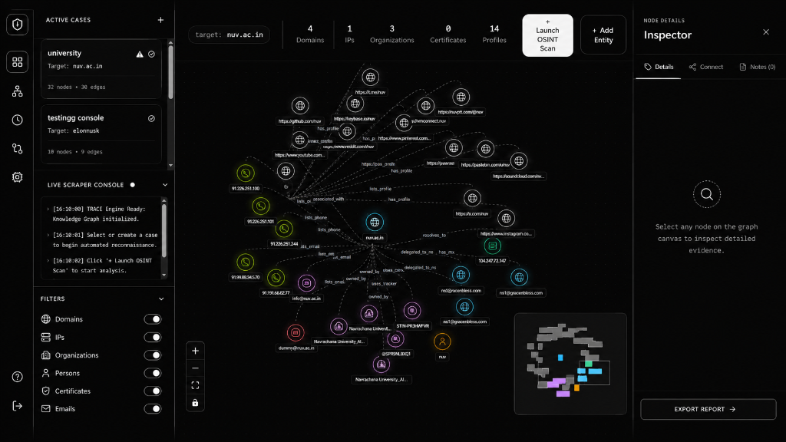
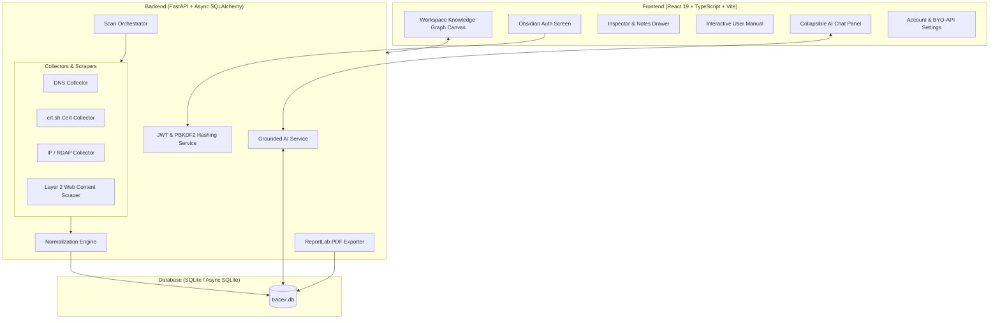

# TRACE — Digital Investigation Workspace & OSINT Intelligence Engine

<p align="center">
  
  <br/>
  <em>Obsidian Precision Dark aesthetic (`#07080f` background, 1px `#27272a` industrial borders), HUD control docks, white primary launch trigger, node details inspector grid, and collapsible AI assistant panel.</em>
</p>

<p align="center">
  <strong>An open-source, enterprise-grade digital investigation workspace, knowledge graph engine, automated OSINT reconnaissance suite, and grounded AI intelligence system built with Obsidian Precision Dark aesthetics.</strong>
</p>

<p align="center">
  
  
  
  
  
  
  
</p>

---

## 🌟 Overview

**TRACE** is a high-density, professional digital investigation platform designed for threat intelligence analysts, security researchers, and OSINT investigators. Inspired by developer-first design systems like Linear, Raycast, and Obsidian, TRACE combines automated non-blocking infrastructure collectors, a real-time web scraper, a deterministic normalization engine, interactive React Flow knowledge graphs, chronological intelligence timelines, snapshot diffing, and grounded AI analysis.

It is built to run **100% locally out-of-the-box for free**, featuring an enterprise **JWT + PBKDF2 Authentication System** and an optional **Bring Your Own API Key (BYO-API)** module for Google Gemini (Free Tier) or air-gapped local Ollama models.

---


## 🚀 Key Features & Architectural Modules

### 1. 🔐 User Authentication & Session Security
- **JWT & PBKDF2 Hashing**: Enterprise-grade password hashing using dynamic 32-byte salts and signed 7-day JWT bearer tokens.
- **Obsidian Dark Auth Screen (`AuthScreen.tsx`)**: Mode switching between "Sign In" and "Create Account", custom role picker (`Lead Investigator`, `Security Analyst`, `Threat Hunter`, `SOC Incident Responder`, `OSINT Researcher`), and a 1-Click Demo Evaluation shortcut.
- **Account & Profile Management**: Edit display name, recon role, update password, and manage active sessions inside the Settings Modal.

### 2. 🕸️ Interactive React Flow Knowledge Graph Workspace
- **Obsidian Dark Aesthetic**: Ultra-dense information architecture, razor-thin 1px borders (`#27272a`), `#07080f` deep canvas background, zero clunky blobs, and custom dark scrollbars.
- **Glowing Aura Custom Nodes**: Visual nodes with real-time glowing type badges for `DOMAIN`, `IP ADDRESS`, `EMAIL`, `PERSON`, `ORGANIZATION`, `USERNAME`, `REPOSITORY`, `URL`, `CERTIFICATE`, `ASN`, `TRACKING_ID`, and `PHONE`.
- **Inspector Drawer & Node Details**: Inspect metadata, evidence confidence levels (`CONFIRMED`, `OBSERVED`, `INFERRED`), connected infrastructure, notes, and PDF exports.

### 3. 📖 Interactive User Manual & Help Center (`HelpModal.tsx`)
- **`?` HUD Action Trigger**: Clicking the bottom-left help icon opens the comprehensive 4-tab user guide:
  - **Quick Start Guide**: Case creation, target scanning, and evidence inspection workflow.
  - **Canvas Controls**: Breakdown of `+ Launch OSINT Scan`, `+ Add Entity`, `AI Assistant`, and HUD canvas controls (`+`, `-`, `Fit View`, `Lock/Unlock`).
  - **Inspector Tools**: Node parameter copying, relationship linking, custom notes, and ReportLab PDF Report Exporter.
  - **Keyboard & Mouse Shortcuts**: Navigation, panning, zooming, and node selection shortcuts.

### 4. 🔍 Automated OSINT Collectors & Web Scraper
- **DNS Collector**: Automatically queries and parses `A`, `AAAA`, `MX`, `NS`, `TXT`, and `CNAME` records.
- **Certificate Transparency Collector**: Queries public `crt.sh` logs for subdomains and shared SSL SAN certificates.
- **IP & Network Collector**: Performs RDAP / WHOIS ASN resolution for IP geolocation and network routing providers.
- **Layer 2 Web & Content Scraper**:
  - **Analytics & Publisher IDs**: Extracts Google Analytics (`UA-`, `G-`), Google AdSense (`pub-`), and GTM tags.
  - **Corporate Metadata & Legal Holders**: Parses footer text and copyright notices to identify corporate hierarchy.
  - **Public Contacts**: Harvests active emails and phone numbers.

### 5. 📜 Intelligence Timelines & Snapshot Diff Engine
- **Chronological Intelligence Stream**: Horizontal timeline slider tracking when elements were discovered or updated over time.
- **Snapshot Diff Engine**: Compares `Snapshot #1` vs `Snapshot #2` side-by-side to calculate exact deltas:
  - <span style="color:#34d399">**+ Green Cards**</span>: Newly added entities & relationships.
  - <span style="color:#f43f5e">**- Red Cards**</span>: Removed assets.
  - <span style="color:#fbbf24">**~ Amber Cards**</span>: Changed or updated properties.

### 6. 🤖 Grounded AI Analysis & BYO-API Module
- **Zero Hallucinations**: Grounded prompt generator formats SQLite graph topology directly into AI context, ensuring 0% invented facts.
- **BYO-API Freedom**: Supports **Google Gemini API** (Free Developer Tier) or 100% offline local **Ollama** models (`llama3`, `mistral`).
- **Collapsible Chat Drawer**: Dedicated collapse/expand toggle so AI guidance never clutters the workspace canvas.

### 7. 📄 One-Click Branded PDF Exporter
- Generates publication-ready PDF intelligence reports (`TRACE_Report_<target>.pdf`) featuring case summaries, target entity breakdowns, relationship lists, and investigation notes.

---

## 🏗️ System Architecture



---

## 💻 Installation & Local Setup

### Prerequisites
- **Python**: 3.10 or higher
- **Node.js**: 18.0 or higher
- **Package Managers**: `pip` and `npm`

---

### Step 1: Backend Setup (FastAPI)

1. Navigate to the `backend` folder:
   ```bash
   cd backend
   ```

2. Create and activate a Python virtual environment:
   ```bash
   python -m venv venv
   # Windows:
   venv\Scripts\activate
   # Linux/macOS:
   source venv/bin/activate
   ```

3. Install backend dependencies:
   ```bash
   pip install -r requirements.txt
   ```

4. Launch the backend server:
   ```bash
   python run_server.py
   ```
   *The backend will run locally on `http://127.0.0.1:5000` with interactive Swagger API docs at `http://127.0.0.1:5000/docs`.*

---

### Step 2: Frontend Setup (React 19 + Vite)

1. Open a second terminal and navigate to the `frontend` folder:
   ```bash
   cd frontend
   ```

2. Install dependencies:
   ```bash
   npm install
   ```

3. Start the Vite development server:
   ```bash
   npm run dev
   ```
   *The web application will open on `http://localhost:5173`.*

---

## 🗺️ Project Structure

```
TraceX/
├── backend/
│   ├── app/
│   │   ├── collectors/          # DNS, Cert, IP, & Web Scraper collectors
│   │   ├── normalization/       # Entity canonicalization & deduplication engine
│   │   ├── services/            # Auth service, scan orchestrator, AI service, PDF exporter
│   │   ├── crud.py              # Async SQLAlchemy database CRUD methods
│   │   ├── database.py          # SQLite engine, AsyncSession, & auto-migration setup
│   │   ├── main.py              # FastAPI REST endpoints & auth routes
│   │   ├── models.py            # ORM models (User, Investigation, Entity, Relationship, Note)
│   │   └── schemas.py           # Pydantic schemas
│   ├── requirements.txt
│   └── run_server.py
├── frontend/
│   ├── src/
│   │   ├── components/          # AuthScreen, GraphCanvas, InspectorDrawer, HelpModal, SettingsModal, Sidebar
│   │   ├── lib/                 # API client helpers (api.ts) & auth token state
│   │   ├── types/               # TypeScript interfaces
│   │   ├── App.tsx              # Main application router & auth state gate
│   │   └── main.tsx             # React entrypoint
│   ├── package.json
│   └── vite.config.ts
├── docs/
│   └── screenshots/             # UI preview images
├── implementation_plan.md
└── README.md
```

---

## 📋 Features Roadmap & Status

- [x] **Obsidian Precision Dark UI**: Linear/Raycast-inspired aesthetic, compact density, 1px borders, HUD control docks.
- [x] **User Authentication System**: JWT bearer tokens, PBKDF2 password hashing, custom roles, AuthScreen with 1-Click Demo.
- [x] **Interactive User Manual (`HelpModal.tsx`)**: Integrated `?` button with Quick Start, Canvas Manual, Inspector Tools, and Shortcuts.
- [x] **Phase 1: Knowledge Graph Workspace**: React Flow graph canvas, custom glowing entity nodes, drawer inspector, notes.
- [x] **Phase 2: OSINT Infrastructure**: DNS, Certificate Transparency, IP/RDAP collectors, entity canonicalization.
- [x] **Layer 2: Web & Content Scraper**: Analytics/Publisher IDs (`UA-`, `G-`, `pub-`), corporate copyright extraction, contact emails, phone numbers.
- [x] **Phase 3: Intelligence Timelines & Diffing**: Timeline event trails and side-by-side snapshot diff engine.
- [x] **Phase 4: Grounded AI Analysis (BYO-API)**: Gemini Free Key & Ollama local support, 0% hallucination context builder, collapsible AI chat panel.
- [x] **Phase 5: PDF Exporter**: Branded PDF report generator for offline case export.

---

## 📄 License

This project is open-source and licensed under the [MIT License](LICENSE).
